# ROS室内机器人系统

**北京航空航天大学计算机学院-智能机器人环境感知与路径规划课程项目-暨第三十届冯如杯科技竞赛参赛项目**


* [系统简介](#系统简介)
* [系统安装](#系统安装)
* [仿真环境](#仿真环境)
   - [机器人建模](#机器人建模)
   - [运行环境](#运行环境)
* [定位建图](#定位建图)
   * [自动定位建图](#自动定位建图)
   * [手动建图](#手动建图)
* [室内导航](#室内导航)
  
   * [定点导航](#定点导航)
   * [固定线路巡航（传回摄像机数据）](#固定线路巡航传回摄像机数据)
   * [算法切换-添加新的导航算法](#算法切换-添加新的导航算法)
   * [局部路径规划参数分析](#局部路径规划参数分析)
   * [全局路径规划算法分析](#全局路径规划算法分析)


## 系统简介

系统实现了基于 `SLAM` 的室内机器人在陌生环境中自主定位建图、定点导航以及图像数据的传输。可以应用在酒店、商场、医院、博物馆、学校教学楼实验楼等室内场所，实现为人们实体引领导航、探索目标、配送物品、提供无接触服务等等场景。

系统依赖 `ROS` 框架，通过其通信机制实现了对机器人的控制、调用传感器数据等功能，版本为 `ROS-Kinetic` ，其运行的环境为 `Ubuntu16.04LTS` 。系统实现所用的机器人是 `Turtlebot2` ，采用其固有的 `Kuboki` 底盘，搭载 `Kinect2` 深度相机以及 `Rplidar` 二维激光雷达。

系统原本计划在搭载传感器的机器人真机上，放置在实际室内环境中测试和完善，但受疫情影响，项目组无法返回实验室得到真机，因此基于 `Gazebo7` 搭建了简单的仿真环境。


## 系统安装

系统开发、运行及仿真的环境为 `Ubuntu16.04LTS` ，请注意虚拟机也许会面临未知的兼容性问题，显卡的性能也会影响图形化和 `3D` 仿真的运行，因此建议使用安装 `Ubuntu16.04LTS` 的真机以及性能不至于过低的显卡来安装和运行系统。

`ROS-Kinetic` 、基本仿真和测试软件以及 `Turtlebot2` 机器人支持代码的安装和简单测试见如下链接的教程：

https://blog.csdn.net/JeremyZhao1998/article/details/104468680

基本软件安装和测试成功后即可建立 `catkin` 工作空间，并克隆本项目代码并编译，注意最后一条 source 的操作**是每次更新 `catkin_ws` 的内容后必须的操作**，若要省去该操作可以将该命令添加到 `~/.bashrc` 文件末尾，这样每次打开终端都会先执行该操作确保内容更新可以被系统识别：

```shell
# 建立catkin工作空间
cd ~
mkdir catkin_ws
cd catkin_ws
# 克隆项目代码
git clone https://github.com/JeremyZhao1998/IndoorRobot.git
# 编译工作空间的代码并刷新环境
catkin_make
source devel/setup.bash
```


## 仿真环境

系统原本计划在搭载传感器的机器人真机上，放置在实际室内环境中测试和完善，但受疫情影响，项目组无法返回实验室得到真机，因此基于 `Gazebo7` 搭建了简单的仿真环境。

### 机器人建模

系统在仿真环境中，在 `turtlebot2` 机器人官方模型的基础上加装了 `hokuyo` 雷达。激光雷达相比 `Kinect` 相机具有扫描范围更大、速度更快的优点，可以更专注于建图与障碍物检测功能，提高运行效率。通过以下的步骤替换系统中的文件，实现仿真环境中 `turtlebot2+Kinect+hokuyo` 协同工作。

```shell
# 进入root权限（需要输入密码）
sudo -i
# 进入turtlebot_gazebo包，替换turtlebot_world.launch文件
roscd turtlebot_gazebo
cd launch/includes
rm turtlebot_world.launch
cp ~/catkin_ws/robot_remould/turtlebot_world.launch ./
# 进入turtlebot_description包，添加kobuki_hexagons_hokuyo.urdf.xacro文件
roscd turtlebot_description/
cd robots
cp ~/catkin_ws/robot_remould/kobuki_hexagons_hokuyo.urdf.xacro ./
# 在turtlebot_description包中替换整个urdf文件夹
cd ..
rm -r urdf
cp -r ~/catkin_ws/robot_remould/urdf ./
# 在meshes/sensors文件夹中添加hokuyo.dae文件
cp ~/catkin_ws/robot_remould/hokuyo.dae ./meshes/sensors/hokuyo.dae
```

替换文件后，需要添加环境变量。打开 `~/.bashrc` 文件，在末尾添加以下指令：

```shell
export  TURTLEBOT_BASE=kobuki  
export  TURTLEBOT_STACKS=heagons
export  TURTLEBOT_3D_SENSOR=hokuyo
export  TURTLEBOT_GAZEBO_WORLD_FILE=/home/zhao/catkin_ws/gazebo_worlds/square_hall.world
```

完成上述工作后，按照下一节内容打开仿真环境后会发现机器人拥有 `kinect` 相机和 `hokuyo` 雷达两个传感器：

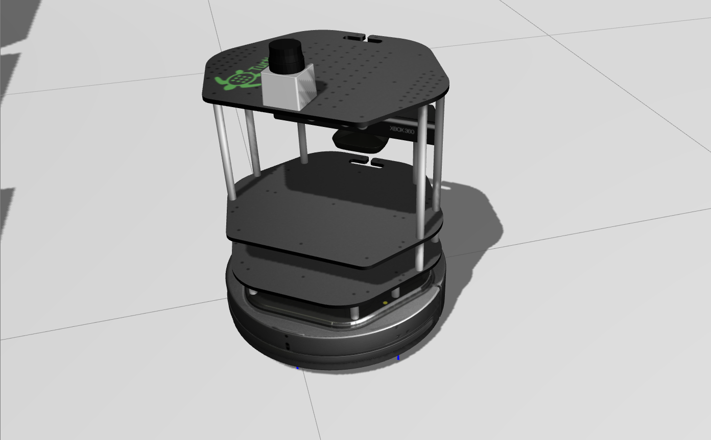

### 运行环境

使用如下命令启用我们已经搭建好的仿真环境：

```shell
roslaunch turtlebot_gazebo turtlebot_world.launch
```

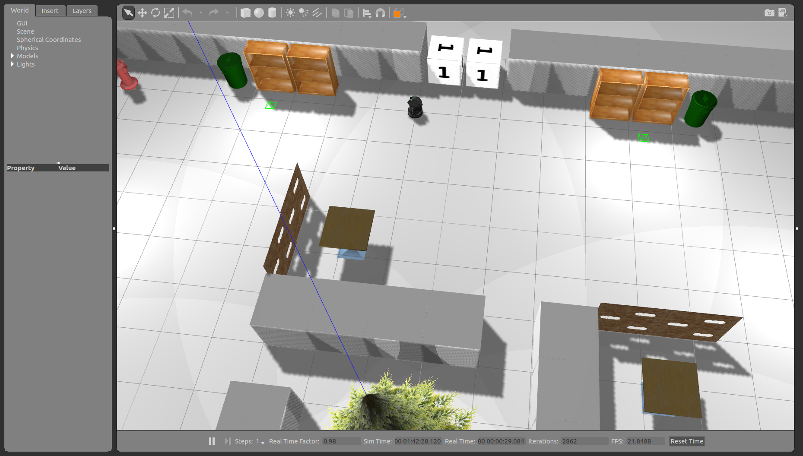

上述命令的省却了 `map_file` 参数参数，默认值设置为了我们搭建的上图的世界文件。该参数是可以修改的，后跟仿真世界文件（.world文件）的完整路径，例如下面的指令。除了上述世界外系统还在 `gazebo_worlds` 文件夹下提供了其他示例世界 。用户也可搭建自己的仿真世界，使用如下指令进入一个空的仿真世界：

```shell
roslaunch turtlebot_gazebo turtlebot_world.launch map_file:=~/catkin_ws/gazebo_worlds/empty.world
```

然后向仿真环境中插入物品，创造属于自己的仿真世界。随后要打开自己的仿真世界，只需要使用上面同样的指令，最后一项改为自己的世界文件即可。


## 定位建图

### 自动定位建图

系统安装了 `RRT` 算法的自动探索建图功能，仿真机器人利用激光雷达进行自动的探索建立二维地图。使用方法如下：

```shell
roslaunch rrt_exploration_tutorials single_simulated_square_hall.launch
roslaunch rrt_exploration single.launch
```

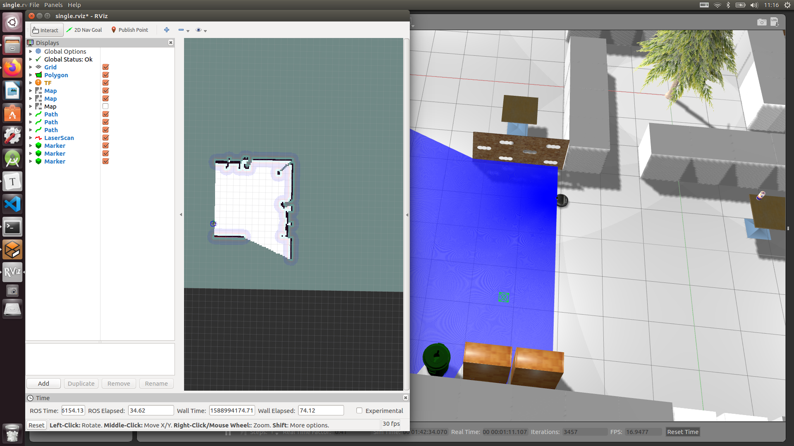

该命令会同时启动仿真界面和 `Rviz` 控制器，在 `Rviz` 界面左上方单击 `2D Nav Goal` 选择导航点，或者使用 `Publish Points` 指定五个导航点，机器人会自动运动到该点并在沿途使用激光雷达建立地图。

当地图建立足够完善时，可以使用以下命令保存地图，其中最后一个参数是想要保存的地图路径和名称：

```shell
rosrun map_server map_saver -f /home/<username>/maps/my_map
```

### 手动建图

除了推荐的自动探索建图外，用户还可以选择手动控制机器人运动建图，该方法的优势在于运行更稳定，可以人工控制机器人扫描每一个死角，并且同样可以远程操作。在此仅演示使用激光雷达的，效率更高的 `hector_slam` 算法。分别在两个终端启用 `Gazebo` 仿真以及 `hector_slam` 算法：

```shell
roslaunch turtlebot_gazebo turtlebot_world.launch map_file:=~/catkin_ws/gazebo_worlds/square_hall.world
```

```shell
roslaunch rplidar_ros hector_mapping_demo.launch
```

分别启动 `Gazebo` 仿真以及 `hector_slam` 算法后，仿真世界里的激光雷达已经开始扫描数据，此时需要启动机器人控制，手动控制机器人运动以探索地图：

```shell
roslaunch turtlebot_teleop keyboard_teleop.launch
```

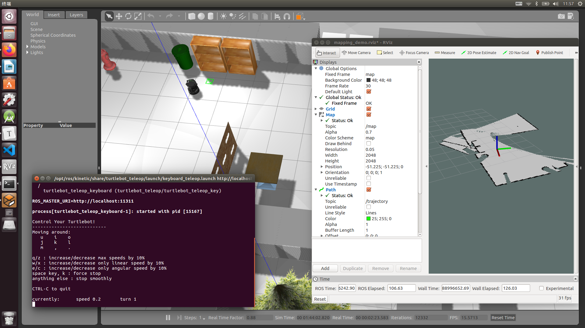

当地图建立足够完善时，可以使用以下命令保存地图，其中最后一个参数是想要保存的地图路径和名称：

```shell
rosrun map_server map_saver -f /home/<username>/maps/my_map
```


## 室内导航

### 定点导航

系统提供了多种导航（全局路径规划）算法可供用户选择，根据不同的地形条件选用不同的算法。分别在三个终端使用以下三条命令启动仿真界面、路径规划节点以及 `Rviz` 控制器：

```shell
roslaunch turtlebot_gazebo turtlebot_world.launch
roslaunch turtlebot_gazebo amcl_demo.launch map_file:=/home/zhao/catkin_ws/ros_maps/square_hall.yaml
roslaunch turtlebot_rviz_launchers view_navigation.launch 
```

`Gazebo` 仿真和 `Rviz` 控制与上面小节提到的相似，不再赘述，设定目标点后机器人会自动规划路径前往目标点。

经过实际测试，局部路径规划算法虽然相对固定，但其控制参数会对导航与机器人运行产生决定性影响。具体参数调试和分析见下面的“局部路径规划参数分析”小节。全局路径规划算法有多种实现，系统提供了六种不中的全局路径规划算法，具体的切换方法见“算法切换-添加新的导航算法”小节，算法的定性与定量分析见“全局路径规划算法分析”小节。

### 固定线路巡航（传回摄像机数据）

在 `~/catkin_ws/scripts` 目录下存放了对机器人控制的 `python` 脚本，包含了发布导航位置、定点拍照、跟随地面标示线等等。其中 `go_to_specific_point_on_map.py` 文件实现了发布定点导航命令。仍然与前文相似地，分别在三个终端使用以下三条命令启动仿真界面、路径规划节点以及 `Rviz` 控制器：

```shell
roslaunch turtlebot_gazebo turtlebot_world.launch
roslaunch turtlebot_gazebo amcl_demo.launch map_file:=/home/zhao/catkin_ws/ros_maps/square_hall.yaml
roslaunch turtlebot_rviz_launchers view_navigation.launch 
```

如果需要传回摄像头画面，可以使用以下命令：

```shell
rqt_image_view
```

此时可以启用系统示例导航脚本：

```shell
cd ~/catkin_ws/scripts
python go_to_specific_point_on_map.py
```

示例脚本中已经编订好了仿真环境中房间（room1 ~ room4）、书架（bookshelf1 ~ bookshelf8）、消防栓（fireHydrant1 ~ fireHydrant4）、书桌（table1 ~ table4）等物件的坐标，只需在命令行输入名称即可自动导航到预定地点，运行期间可以通过摄像机查看沿途的实时视频数据。通过简单的 `python` 不难实现将这些导航点串联在一起依次导航，从而实现固定线路的巡航，在此不再赘述。

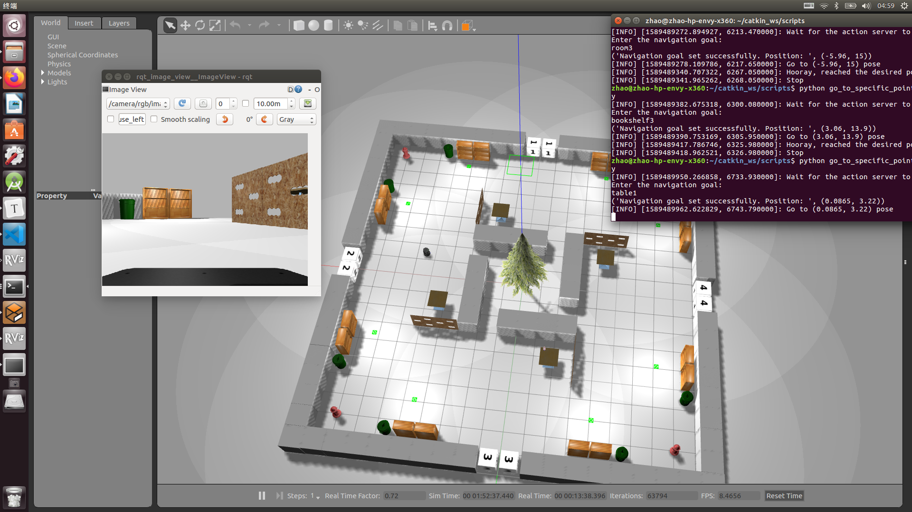

另外，若要添加新的导航点，需要以下几个简单步骤：

首先获取导航点的具体坐标，打开 `Rviz` 界面，选中右上角的 `Publish Points` ，当鼠标在地图上移动时，界面最底部会显示一组三维坐标，即为鼠标当前位置在地图中的坐标。在本系统的二维地图导航中，第三个数 z 坐标始终取 0 即可。

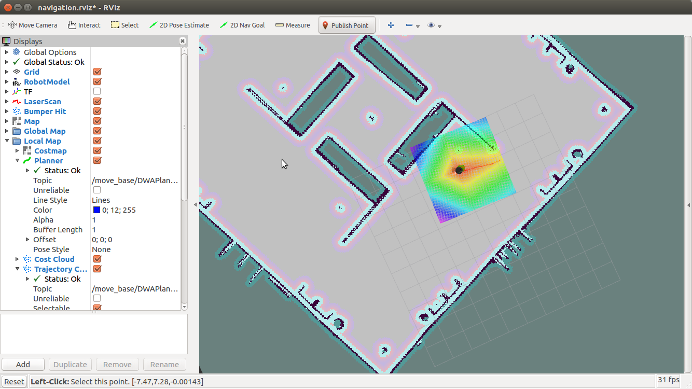

其次，对照地图寻找想要放置的导航点，根据鼠标位置反馈的坐标记录坐标值，然后添加到 `~/catkin_ws/scripts/go_to_specific_point_on_map.py` 文件的第86行起：

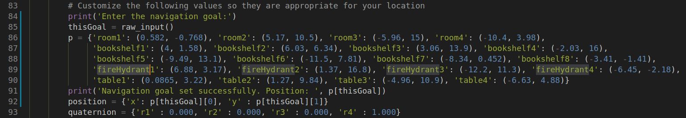

当然，熟悉 `python` 编程后不难实现更复杂的导航点控制逻辑，以至于更完善的交互，不再赘述。

### 算法切换-添加新的导航算法

系统提供了六种不同的全局路径规划算法，算法的切换接口在文件：`~/catkin_ws/src/navigation/move_base/src/move_base.cpp` 的第119行起：

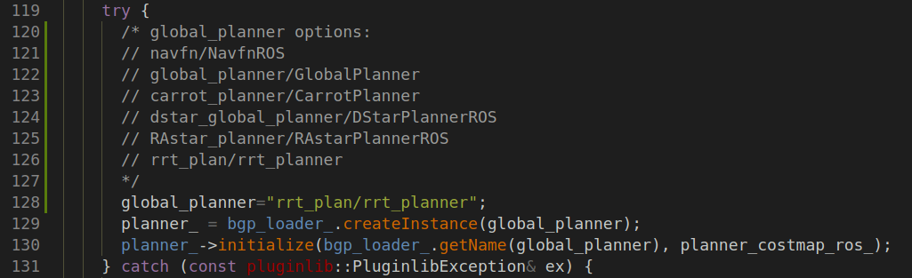

注释表明了第128行变量 `global_planner` 可能取的值，其中每一行代表了一种全局路径规划算法。若想要切换算法，需要修改该值为想要使用的算法名称。同时，需要修改 `~/catkin_ws/src/navigation/move_base/cfg/MoveBase.cfg` 文件第9行末尾为相同的内容：

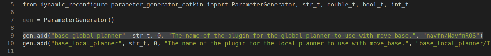

修改完毕后需要退回 `~/catkin_ws` 目录下执行 `catkin_make` 并重新打开终端以便刷新环境，使得修改生效。

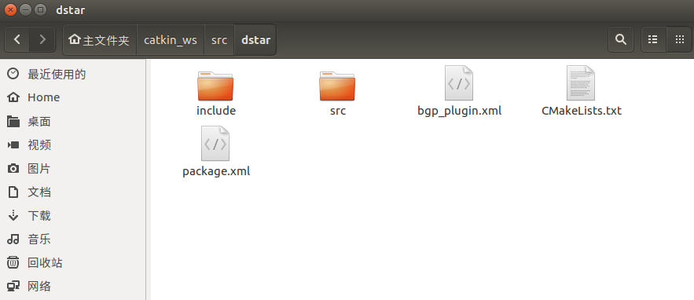

同样地，想要添加新的导航算法，系统也提供好了模板。在目录 `~/catkin_ws/src/dstar` 下存放着 `DStar` 算法的源码模板，其中包含了源码 `src` 文件夹、包含文件 `include` 文件夹、`plugin.xml` 文件、`CMakeList.txt` 文件和 `package.xml` 文件。通过这些文件模板的实现可以创建自己新的路径规划算法，创建后的算法同样修改上面所述的两个文件即可。

### 局部路径规划参数分析

系统使用的默认局部路径规划算法是 `DWA` 算法，其源码的位置在 `~/catkin_ws/src/navigation/dwa_local_planner` 目录下。局部路径规划与全局路径规划不同之处在于，其并非根据全局地图信息计算起点到终点的最优解，而是贴合全局路径规划路径的方向，结合传感器数据实时感知环境变化，直接控制机器人底盘。换言之，机器人运行的直接控制在局部路径规划模块，其使得机器人在局部环境中拥有行进和避障的能力。

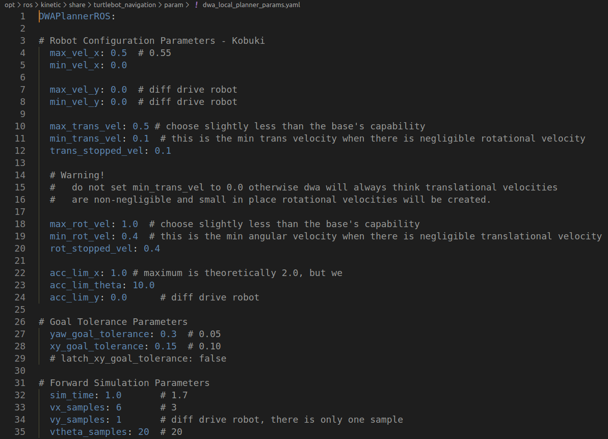

局部路径规划算法中的一系列参数对机器人运行起着决定性作用。上图是本系统局部路径规划参数设置文件的部分，是位于 `/opt/ros/kinetic/share/turtlebot_navigation/param` 目录下的 `dwa_local_planner_params` 。参数的作用已经如注释标注，分别控制机器人运动的线速度、角速度、线加速度、角加速度等等。参数应根据机器人实际情况而设定，例如如果机器人承担着运送物品的任务时，应当适当降低其线加速度，避免机器人质量较大惯性较大时，加速减速容易产生的不稳定。

在本系统中，经实验证实如果按照默认的参数配置，机器人容易产生一遍旋转一遍前进，或者较为严重的S形前进的现象。机器人总体上会沿着路径规划的方向行进，但当机器人需要转向超过90°时，其旋转运动和平移运动不能很好地匹配，机器人会呈现出旋转着前进或S形前进的姿态，并且恰好在转至偏离目的地时重新规划路径，对时间和计算资源都是一种耗费，并且无法在沿途正常地收集摄像机视频数据。

上述问题可以仅通过修改参数而不调整算法来实现。经分析，机器人出现出现旋转前进或S形前进的原因在于，其旋转运动和平移运动几乎同时进行时，在旋转至所需姿态后，机器人的旋转惯性使得其难免地向反方向偏离姿态，局部路径规划通过传感器检测到偏离航向，此时恰好全局路径规划以固定的频率更新规划，新路径根据偏离的方向重新控制底盘运动，重新旋转至目标方向，然后重复上述过程。

因此解决上述问题一方面在于控制旋转到正确方向时反向偏离不至于过大，另一方面在于控制重新规划路径的频率，使得一次路径规划至少能保证机器人在平滑的路线上平稳运行。根据实验分析，最优的参数如下：首先修改 `/opt/ros/kinetic/share/turtlebot_navigation/param/dwa_local_planner_params.yaml` 文件第18行最大旋转速度 `max_rot_vel` 变量，放慢旋转速度起到控制旋转至正确姿态后偏离角度的作用。其次修改 `/opt/ros/kinetic/share/turtlebot_navigation/param/move_base_params.yaml` 第11行的 `planner_frequency` 变量，使得重新规划路径的频率降低，让每一次路径规划充分发挥作用。

下面是控制 `planner_frequency` 为1.0不变，改变最大旋转速度 `max_rot_vel` 对转向导航过程的影响。全局路径规划算法选用了 `navfn/NavfnROS` ，目标点设定8号书架，即机器人起始位置姿态后方约20米处，起始和目标点直线距离之间没有障碍物。机器人运动过程大体为：首先从背向目标点转为朝向目标点方向，随后会经历一段的S形抖动前进，最后能够基本贴合规划的路径正常前进。

| `max_rot_vel` | 转向时间/s | S形抖动前进时间/s | 正常前进时间/s | 任务总时间/s |
| ------------- | ---------- | ----------------- | -------------- | ------------ |
| 5.0           | 4.18       | 24.55             | 10.75          | 39.48        |
| 3.0           | 4.20       | 11.56             | 19.33          | 35.60        |
| 2.0           | 4.47       | 11.46             | 19.79          | 35.73        |
| 1.75          | 4.38       | 8.93              | 20.99          | 34.31        |
| 1.5           | 4.21       | 2.65              | 24.21          | 31.08        |
| 1.25          | 4.58       | 1.03              | 25.97          | 31.59        |
| 1.0           | 6.67       | 0.20              | 27.01          | 33.89        |

可以看出最大旋转速度 `max_rot_vel` 从5.0降低为1.5的过程，由于旋转速度被限制，转向时间会波动增加，但S形抖动前进的时间会明显降低，正常行进的时间随之增加，但由于正常前进节省了转向和多走路程的时间，任务的总时间会降低，性能得到提升。而 `max_rot_vel` 从1.5进一步降低到1.0时，转向时间有较为明显的增加，换来的利好是S形抖动消失。虽然1.0时任务总时间反而有增加趋势，但我们推测是由于S形前进时重新规划路径获取的较大加速度抵消了部分S形抖动多走路程花去的时间。为了消除抖动，使机器人运行平稳以便运送物品或传回稳定的视频画面，我们建议在此情境下使用 `max_rot_vel` 参数为1.0。

`planner_frequency` 对于消除S形抖动起到的作用并不大，其主要用于调控边转圈边前进的情况。该实验过程较为简单，经试验发现对于边旋转边前进的现象，在 `max_rot_vel` 取值1.0的基础上将 `planner_frequency` 下调至0.1可以消除旋转前进的现象。

### 全局路径规划算法分析

系统提供了六种全局路径规划算法，这些算法各有优劣，适用于不同情境的导航，用户可以根据情景选用不同的导航算法。下面对不同的导航算法加以定性分析：

#### `navfn/NavfnROS` 

`navfn/NavfnROS` 算法是 `ROS` 官方代码包最初实现的全局路径规划算法，实现了简单 `Dijkstra` 和 `A*` 算法。算法整体性能优异，能够以较快的速度直接规划出完整地图中较远距离目标点的路径，在一般复杂程度情境下（例如系统给出的默认地图）运行稳定性极佳。

该算法的缺点在于，只能规划出前往已知地图范围内的目标点。当收到一个处于障碍，例如墙壁之中的目标点，或地图范围之外的目标点时，算法会陷入计算 `costmap` 的循环，在较长时间计算之后才会报告无法规划路径。算法没有探索性能，容错的反应性能同样不佳。

#### `global_planner/GlobalPlanner`

`global_planner/GlobalPlanner` 是对 `navfn/NavfnROS` 包的修复和升级版本，同样实现了 `Dijkstra` 和 `A*` 算法，但修复了 `navfn/NavfnROS` 包已知的一些错误，并调整算法结构和具体实现，实现了计算性能上的升级。相对 `navfn/NavfnROS` 而言计算速度更快，规划路径更平滑，路径线长度更短（减少了不必要的转向），是运行本系统默认地图推荐的最佳算法。

由于同样采用 `Dijkstra` 和 `A*` ，`global_planner/GlobalPlanner` 包与 `navfn/NavfnROS` 的缺点相同，同样无法规划出障碍物之中或地图范围之外目标点的路径，没有探索性能。

#### `carrot_planner/CarrotPlanner`

`carrot_planner/CarrotPlanner` 实现了最简单的路径规划算法——总是规划出到达目标点最短的直线路径。这样简单到古朴的路径规划算法是双刃剑一样的存在。一方面，其巨大劣势在于复杂地形条件下几乎无法完成任务，当前点和目标点之间的任何物体都会挡住机器人前进的步伐，并且没有避障能力。可以说在绝大多数常规导航情境下，`carrot_planner/CarrotPlanner` 都不应当被作为主要的全局路径规划算法。

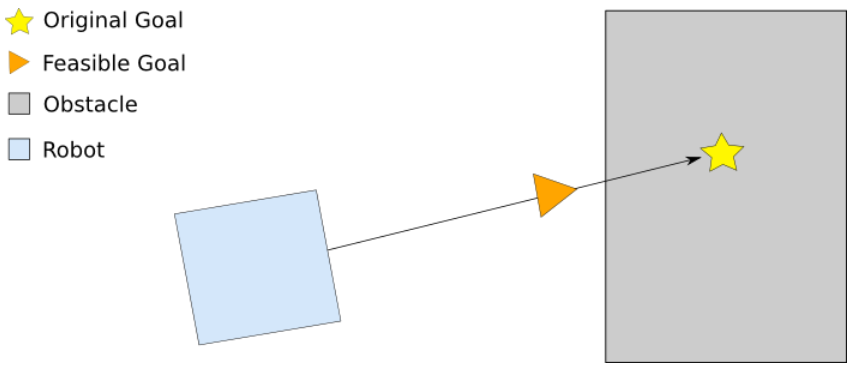

但如上图所示，`carrot_planner/CarrotPlanner` 一大独有的优势在于其良好的探索能力。当算法检测到目标点不在地图范围内，或位于障碍物之中时，算法会将距离原目标点最近的地图中的点作为目标点。这种特性使得算法可以尽可能地接近目标点，而不是像其他算法那样无法规划路径。另一方面，`carrot_planner/CarrotPlanner` 总是规划出最短的直线路径，这在某些特殊情境下相对其他算法拥有不可比拟的优势，例如简单空旷的地图，或者在跟随问题上，算法运行的效率极高，是最适合实现跟随算法的全局路径规划。

#### `dstar_global_planner/DStarPlannerROS`

`DStar` 算法是颇负盛名的路径规划算法之一，但简单的 `DStar` 被我们在实践中证实，其劣势并不能完全弥优势。`dstar_global_planner/DStarPlannerROS` 拥有规划出的路径准确、最短且平滑的优秀特性，机器人运行会更加顺滑，也能在避障的前提下寻找到最近最优的路径。

但在实践中，`DStar` 不可挽回的劣势在于其对计算机算力的消耗，这使得在仿真实践中（至少在我们的计算机上）实践效果不佳。在不太长距离的目标计算路径规划过程中，仿真环境中大约10~15米的直线距离需要计算超过20秒，而更远的目标常常计算出路径规划失败，不可达的结果。除此之外，太过复杂的地形也无法在可以容忍的时间内计算出结果。我们推测在实际情境下使用算力更强的主机可以发挥算法的优势，但在仿真环境中不推荐使用 `DStar` 算法。

#### `RAstar_planner/RAstarPlannerROS`

`RAstar_planner/RAstarPlannerROS` 实现的是 `Relaxed A*` 算法，是对 `A*` 算法的改良，相对 `global_planner/GlobalPlanner` 中实现的 `A*` 算法进一步提高了运行速度，在仿真实践中几乎感受不到路径规划的计算时间，在系统的六种路径规划中属最优。

 `Relaxed A*` 算法规划路径实质上是采用了局部路径规划“代替”全局路径规划，才可以达到起始阶段极佳的运算速度。首先朝向重点的大致方向行进，在路途中进一步计算以调整前进方向。但这种做法在收获更好的计算效率的同时会带来路径规划的误差，在准确性方面不如 `global_planner/GlobalPlanner` ，而在规划出路径的线长度方面不如 `dstar_global_planner/DStarPlannerROS` ，不过在本实验搭建的环境中足以表现出合格的路径规划表现。

#### `rrt_plan/rrt_planner` 

`rrt_plan/rrt_planner` 是基于快速扩展随机树的路径规划算法，与其他算法不同的是，`RRT` 通过对采样点进行碰撞检测而避免了对整个空间的建模，能快速而有效地搜索高维空间。因此 `RRT` 的优势在于复杂地形的快速路径搜索，而对于自由度较高的机器人也显得更有优势，例如高自由度的机械臂在三维空间中的避障运动等。在实践中，由于我们搭建的地图地形复杂程度一般，所以并没有特别体现出算法运算速度的优势。

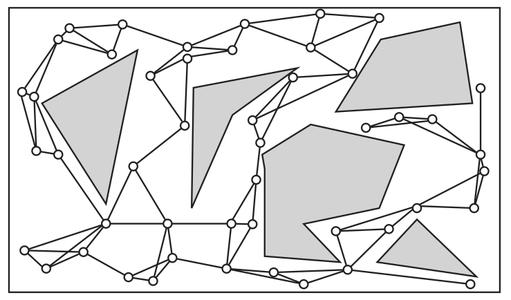

但另一方面，`RRT` 是概率完备但非最优的，即 `RRT` 规划出的路径可能与真正的最优路径有一定的差距。如上图，`RRT` 规划的路径与采样点有关，而点与点之间直接通过线段相连，这使得最终规划的路径是折线，并不平滑，并且可能有急转弯，机器人实际运行时无法严格依据路径行驶，转弯的增多也使得机器人运行时间相应地增长。


下面是仿真实验中各个算法在不同任务中的表现，其中简单路径是目标点与起始点直线距离之间无障碍物的，复杂路径需要算法选择是否穿越地图中心矩形以求得最短路径，远距离路径运行了正方形地图的对角线。

| 算法               | 简单路径运行时间/s | 复杂路径运行时间/s | 远距离路径运行时间/s | 远距离路径计算用时/s | 障碍物之中的目标点 |
| ------------------ | ------------------ | ------------------ | -------------------- | -------------------- | ------------------ |
| `NavfnROS`         | 30.19              | 35.39              | 62.20                | 0.89                 | 陷入循环           |
| `GlobalPlanner`    | 31.44              | 51.09              | 60.72                | 0.75                 | 立即报告失败       |
| `CarrotPlanner`    | 27.98              | 失败               | 失败                 | --                   | 接近目标点         |
| `DStarPlannerROS`  | 70.31              | 失败               | 失败                 | --                   | 计算报告失败       |
| `RAstarPlannerROS` | 31.53              | 39.25              | 88.25                | 毫秒级               | 立即报告失败       |
| `rrt_planner`      | 38.45              | 42.60              | 80.06                | 0.32                 | 陷入循环           |

